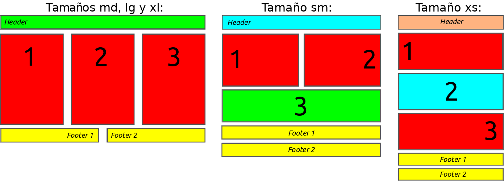

Para este ejercicio crearás una pequeña página web que debe cumplir con la estructura presentada aqui:

Como ves en este modelo, la disposicion de las columnas y la alineación de los textos variará dependiendo del tamaño de la pantalla. Tenéis que reproducir este comportamiento para que la apariencia de la web sea similar al esquema (número de columnas, alineaciones de los textos y colores) cuando el tamaño de la pantalla sea la de un tablet (sm) o la de un teléfono (xs).

Cosas a tener en cuenta:

- Siempre que sea posible se utilizarán las clases que provee Bootstrap.

- Cuando no sea posible (por ejemplo para controlar la alineación de los textos y el cambio de color del fondo) tendréis que definir una media query que lo haga.